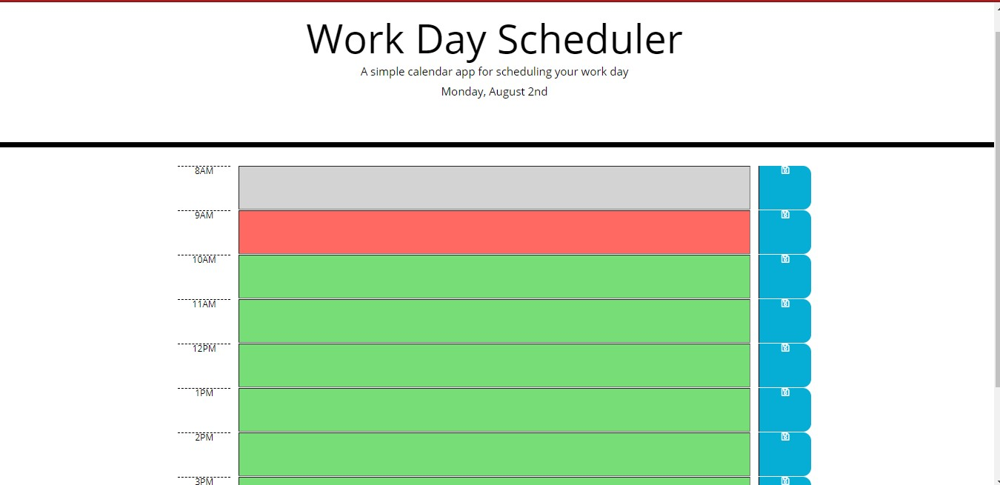

# Work Day Scheduler

  ## Description

    This is a simple calendar application that allows a user to save events for each hour of the day. 
    
  
  ## Table of Contents
 
  * [Installation](#installation)
  * [Usage](#usage)
  * [Credits](#credits)
  * [License](#license)
  
  ## Installation

    Please navigate to project folder and open index.html file in a browser. 

  ## Tools
	HTML,Javascript, CSS	
  
  ## Usage

    A simple calendar application that allows a user to save events for each hour of the day. 
  
  ## Credits
 

  ## License
 
  
  ## Badges
 
  
  ## Contributing
 
  
  ## Tests

  There is no test available for this application yet

  ## Questions
    
  https://github.com/hikod

